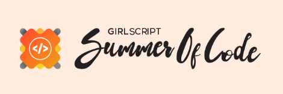

<div id="top"></div>
<div align="center">


[See Live!](https://narayan954.github.io/dummygram/)

### _Instagram_, dummified

<div align="center">
      
      
      
      <br>
      
      
      
      
      <br>
      
      
      
 </div>

---

</div>

<h1 align="center">About Dummygram</h1>

## Vision

When you start learning ReactJS, it's crucial to work on projects that interest you. One exciting idea is to create a clone of the app made by the company that created ReactJS. In this case, let's build an Instagram clone. It will have similar features to the popular social media platform, but we can also add some new functions.

Creating an Instagram clone is a fantastic chance for learning and improvement. By doing this project, you can contribute to the ReactJS community while also growing your knowledge and skills. It will be a fun way to practice and make something cool!

## Status

Since September 2022, Dummygram has been a project that the team is passionate about and committed to making excellent. They put the project on GitHub from the beginning to work together with the community and welcome contributions from others.

The team has clear priorities and ongoing work to improve Dummygram, but they also focus on making it look unique and attractive. They have a great sense of design and want the app to stand out from other similar apps. Using ReactJS, they can add custom styles and create a fun and exciting experience for users.

Overall, the Dummygram team loves what they do and wants to make the app visually stunning and enjoyable for everyone!

## Features

**User Authentication:** DummyGram includes a user authentication system, allowing users to create accounts, log in, and log out securely. This feature ensures that only authenticated users can access and interact with the app.

**Posts:** Users can create posts and share them with others. Posts can include various types of content, such as images, videos, or text. Users can upload media files from their devices or provide URLs for online content. These posts are displayed in a feed-like format.

**Commenting:** DummyGram enables users to comment on posts. Users can write and submit comments on individual posts, engaging in conversations and discussions with other users.

**Like Feature:** Users can express their appreciation for posts by liking them. This feature allows users to show their support and interest in specific content shared on DummyGram.

**Delete Functionality:** DummyGram allows users to delete their own posts. This feature provides users with control over their content, enabling them to remove posts they no longer wish to keep on the platform.

**Frontend Framework:** The user interface of DummyGram is built using ReactJS, a popular JavaScript library for building interactive user interfaces. ReactJS allows for efficient rendering of components and provides a smooth and responsive user experience.

**Backend and Data Storage:** DummyGram utilizes Firebase as the backend service for storing user data, posts, and comments. Firebase provides a scalable and reliable platform for handling backend functionalities and offers real-time database capabilities, ensuring efficient data storage and retrieval.

# Docs

- Table of Contents

  - [Codebase](#codebase)

    - [Technologies](#technologies)
    - [Folder Structure](#folder-structure)

  - [Project Setup](#project-setup)

    - [First time setup](#first-time-setup)
    - [Installation](#installation)
    - [Running the app locally](#running-the-app-locally)

  - [Testing](#testing)
  - [How to get started with Open Source](#how-to-get-started-with-open-source)
  - [How to use Dummygram](#how-to-use-dummygram)
  - [Contributing](#contributing)
  - [Rules](#rules)
  - [Open Source Programs](#open-source-programs)
  - [License](#license)

## Codebase

### Technologies

With the ground rules out of the way, let's talk about the coarse architecture of this mono repo:

**Frontend JavaScript**: We use React to power our frontend apps. Almost all of the code you'll touch in this codebase will be JavaScript.


Here is a list of all the big technologies we use:

- **React**: Frontend React app 

- **Firebase**: Data storage and Authentication 

### Folder structure

```sh

dummygram/

├── public # Public files used on the frontend

├── src # Frontend Code in React

```

## Project Setup

### First time setup

The first step to running dummygram locally is downloading the code by cloning the repository:

<details><summary>Video Demo to run Dummygram in your local under 2 minutes</summary> <br>

<https://github.com/narayan954/dummygram/assets/77617189/c21f0bdc-e845-4c32-b148-54d8048cbc33>

</details>

```sh

git clone git@github.com:narayan954/dummygram.git

```

If you get `Permission denied` error using `ssh` refer [here](https://help.github.com/articles/error-permission-denied-publickey/)

or use `https` link as a fallback.

```sh

git clone https://github.com/narayan954/dummygram.git

```

### Installation

Dummygram has a single installation step:

- **Install the dependencies**:

```sh

npm install

```

You've now finished installing everything! Let's start :100:

Ps: if you're getting error installing the dependencies, try --force command along with npm install. For example

```sh

npm install --force

```

Now you're ready to run the app locally and sign into your local instance!

### Running the app locally

#### Start the servers

To Start the development server run

```sh
npm start
```

<div  align="center"></div>

## Testing

<details>
    <summary>Instructions</summary>

Here we will see, how to run tests and how to setup new test cases.
_We will be using Cypress for our testing purposes._

### Introduction to Cypress


<details><summary>See More</summary> <br>

Cypress is a relatively new automated tests tool which is gaining popularity at a very rapid pace

Here is the home page for Cypress if someone wants to look it up
<https://www.cypress.io/>

Cypress has very strong documentation so a new comer could find most of the information from their own site
<https://docs.cypress.io/guides/overview/why-cypress.html#In-a-nutshell>

Also as a starting point it would be good to go through these tutorial videos
<https://docs.cypress.io/examples/tutorials>

</details>

---

### Start Testing

> You need to [setup](#project-setup) the project as usual, and after that we can run our test cases.

<sub>See It Running</sub>

<https://user-images.githubusercontent.com/84321236/223492442-1b161401-4ca2-41f7-832d-7302e2832b5a.mp4>

<details><summary>See More</summary> <br>

1. **Run This Command**

```zsh
npm run cypress:open
```

_It will open up this window,_


> As you can see, we only added E2E testing

2. **Click on E2E Testing & Select Browser**


3. **Now Click on any Test to Run it**


</details>

---

### Create New Test Cases

Working Directory: `/cypress/` <br>
E2E Files: `/cypress/e2e/`


<details><summary>See More</summary> <br>

**To Create New E2E Tests**

1. Goto `/cypress/e2e/`
2. You can create new file (similar to `spec.cy.js`). <br>
   **OR** add new `it` function inside existing `describe` function in this existing file.


3. Then, [test](#start-testing) your test cases:

   ```zsh
   npm run cypress:open
   ```

</details>
</details>

---

## How to get started with Open Source

Here's a quick rundown on how to get started with open source. First of all, let's know some basic terminologies:

- Git: This is a versioning system that lets you store your code and code history on your local computer, preventing loss and allowing sharing of that code.
- Github: This is a server that lets you store the history in a database.
- Open Source: A project is said to be open sourced if you can see the code on GitHub.
- Fork: This is a copy that you make of a project on GitHub, it gets added to your repositories.
- Repository: A project on GitHub is called a repository.
- Pull Request: This is a fix for an issue proposed to be done in a project, this consists of you editing a file in the project.
- Issue: An issue is a change that should be done in a project, can be a bug, a new feature or a suggestion to a project.
- Branch: A branch is a new workspace derived from the default workspace(main or master) that allows you to work on something without affecting the original code.

Now you know some basic terms, let's get into how to get started with some resources to let you understand open source better:

- [Crash Course to Git and Github](https://www.youtube.com/watch?v=apGV9Kg7ics) - Video
- [A complete Guide to Open Source](https://www.youtube.com/watch?v=yzeVMecydCE) - Video
- [Guide to Open Source](https://www.freecodecamp.org/news/how-to-contribute-to-open-source-projects-beginners-guide/) - Article

## How to use Dummygram

[Flow of Control](FlowOfControl.md)

## Contributing

**We heartily welcome any and all contributions that match our engineering standards! :raised_hands:**

That being said, this codebase isn't your typical open source project because it's not a library or package with a limited scope—it's our entire product.

## Rules

- **No `console.log`s in any file**: We use the `debug` module across the codebase to log debugging information in development only. Never commit a file that contains a `console.log` as CI will fail your build. The only exceptions are errors, which you can log, but you have to use `console.error` to be explicit about it
- **Code reviews**: All submissions, including submissions by project members, require review. We use GitHub pull requests for this purpose.

### Contributions and discussion guidelines

🎊All conversations and communities on Dummygram agree to GitHub's [Community Guidelines](https://help.github.com/en/github/site-policy/github-community-guidelines) and [Acceptable Use Policies](https://help.github.com/en/github/site-policy/github-acceptable-use-policies).

🎊Code of conduct is applied for all conversations that happen within the contributor community here on GitHub.

🎊Discussions are important,productive and respectful.

🎊**Remember**:-There are real people on the other side of that screen:exclamation:

### Reporting a bug or discussing a feature idea

If you found a technical bug on Dummygram or have ideas for features we should implement, the issue tracker is the best place to share your ideas. Make sure to follow the issue template and you should be golden! ([click here to open a new issue](https://github.com/narayan954/dummygram/issues/new))

### Fixing a bug or implementing a new feature

- If you find a bug on Dummygram and open a PR that fixes it we'll review it as soon as possible to ensure it matches our engineering standards.
- If you want to implement a new feature, open an issue first to discuss what it'd look like .
- If you want to contribute but are unsure to start, we have [a "good first issue" label](https://github.com/narayan954/dummygram/issues?q=is%3Aissue+is%3Aopen+label%3A%22good+first+issue%22) which is applied to newcomer-friendly issues. Take a look at [the full list of good first issues](https://github.com/narayan954/dummygram/issues?q=is%3Aissue+is%3Aopen+label%3A%22good+first+issue%22) and pick something you like!
- Want to fix a bug or implement an agreed-upon feature? Great, jump to the [local setup instructions](#first-time-setup)!

## Code of Conduct

Dummygram is now part of GitHub. For code of conduct, please see [GitHub's Community Guidelines](https://help.github.com/en/github/site-policy/github-community-guidelines) and [Acceptable Use Policies](https://help.github.com/en/github/site-policy/github-acceptable-use-policies).

<div  align="center"></div>

## Programs

<details>
    <summary>List</summary>
<p align="center">

<a href="https://hacktoberfest.com/"></a>

<p align="center">
<a href="https://www.codepeak.tech/"></a>
&nbsp; &nbsp; &nbsp; &nbsp;
<a href="https://kwoc.kossiitkgp.org/"></a>
</p>

<p align="center">
<a href="https://gssoc.girlscript.tech/"></a>
&nbsp; &nbsp; &nbsp; &nbsp;
<a href="https://jwoc.tech/"></a>
</p>

<a href="https://iwoc.live/"></a>

</p>
</details>

## Feedback

If you have any feedback or suggestions please reach out to the Project-Maintainer [Narayan Soni](https://github.com/narayan954)

<div align="left">
For further queries and whereabouts you can communicate and reach out to the owner through <a href="https://www.linkedin.com/in/narayan-soni/">Linkedin</a> & <a href="mailto:narayansoni954@gmail.com">email</a>
</div>

## 👩🏽‍💻 Contributing

- Contributions make the open source community such an amazing place to learn, inspire, and create.
- Any contributions you make are greatly appreciated.
- Check out our [contribution guidelines](/CONTRIBUTING.md) for more information.

<br>

<div align="center">

## Thanks to all Contributors 💪

Thanks a lot for spending your time helping dummygram grow. Thanks a lot! Keep rocking 🍻

<details>
    <summary>Contributors</summary>
    <div>
      <a href="https://github.com/narayan954/dummygram/graphs/contributors">
      
      </a>
    </div>
</details>

## License

**MIT License, see the [LICENSE](./LICENSE) file.**

<br>

<h3><b>Take a moment to star ⭐ the project if you like it</b></h3>
    <h3>Do checkout the other repos 💫</h3>

</div>
<p align="right">(<a href="#top">Back to top</a>)</p>
