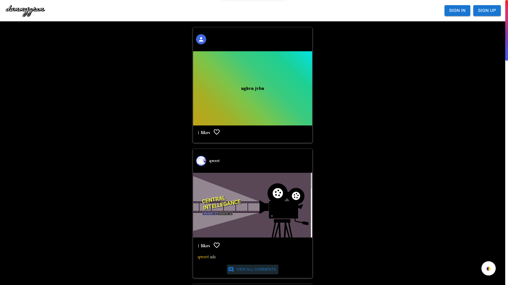
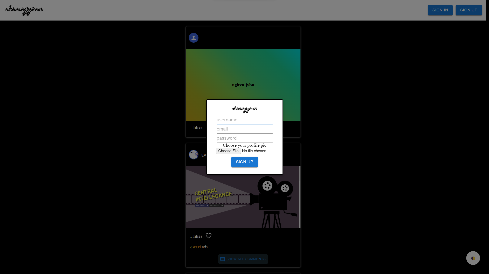
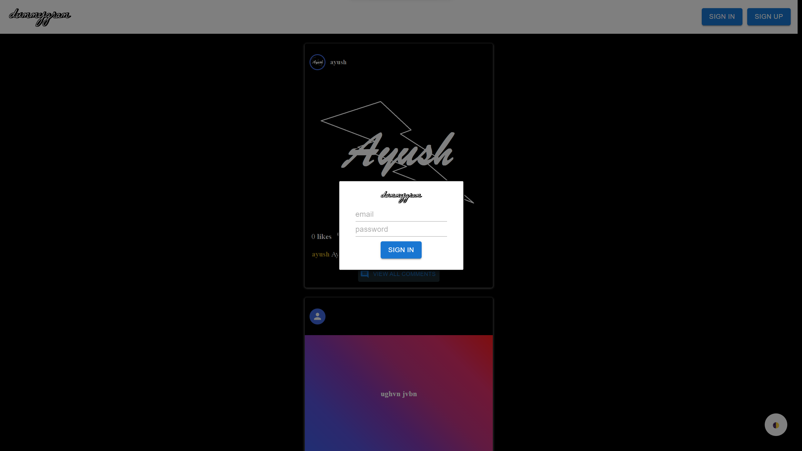
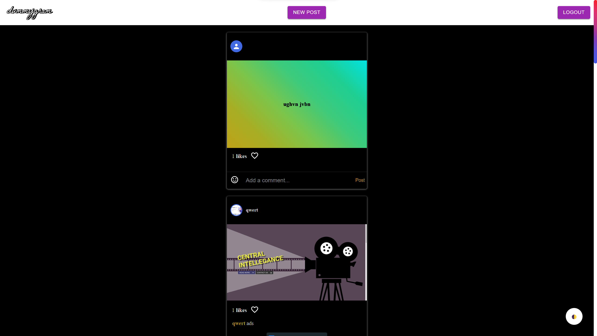
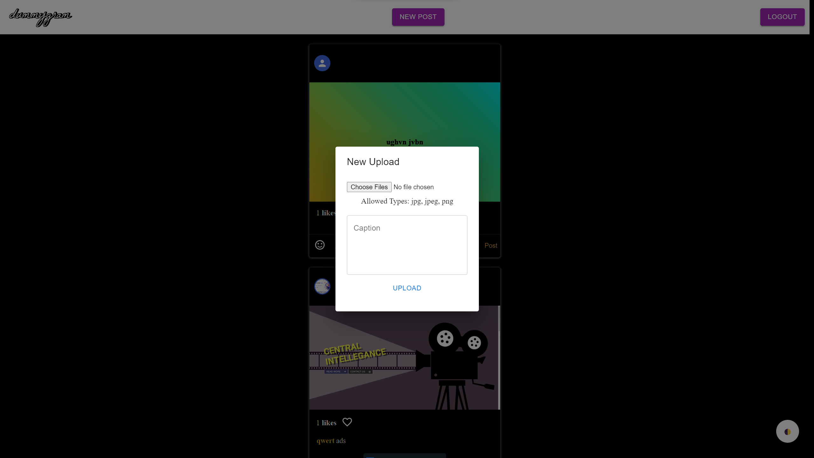
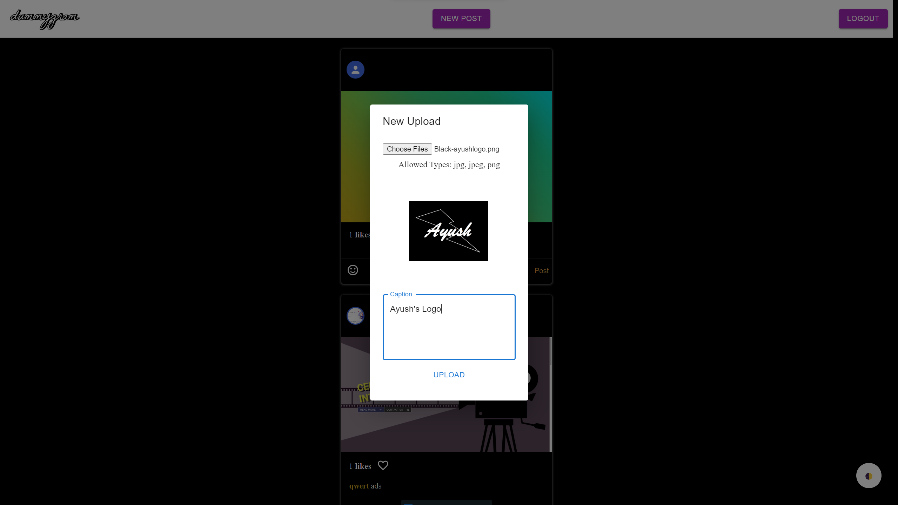
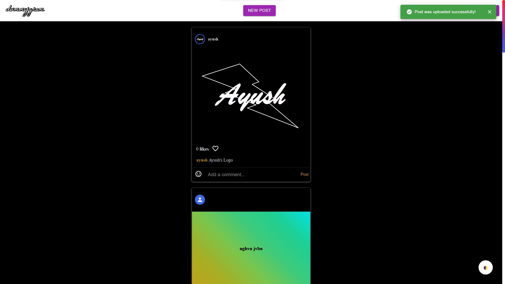
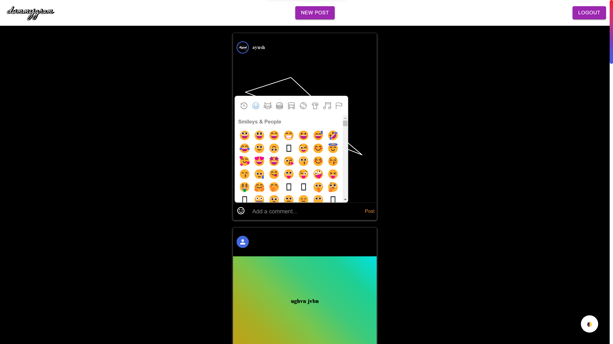
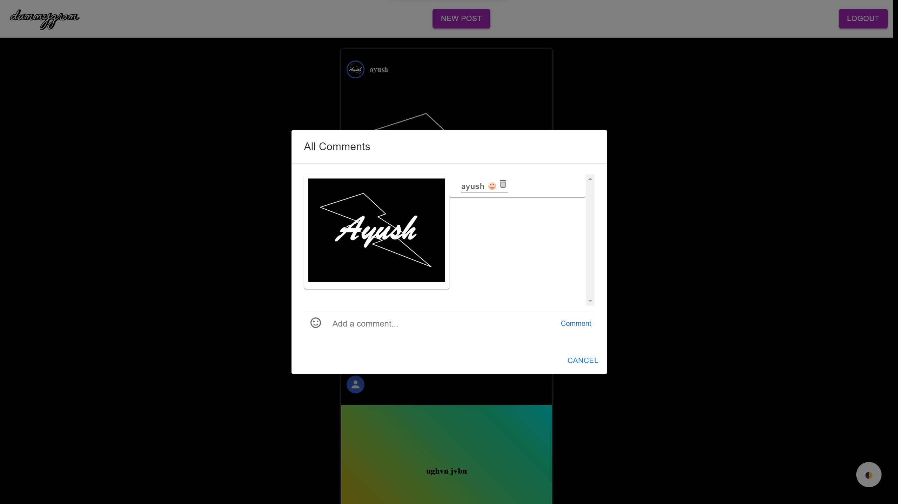
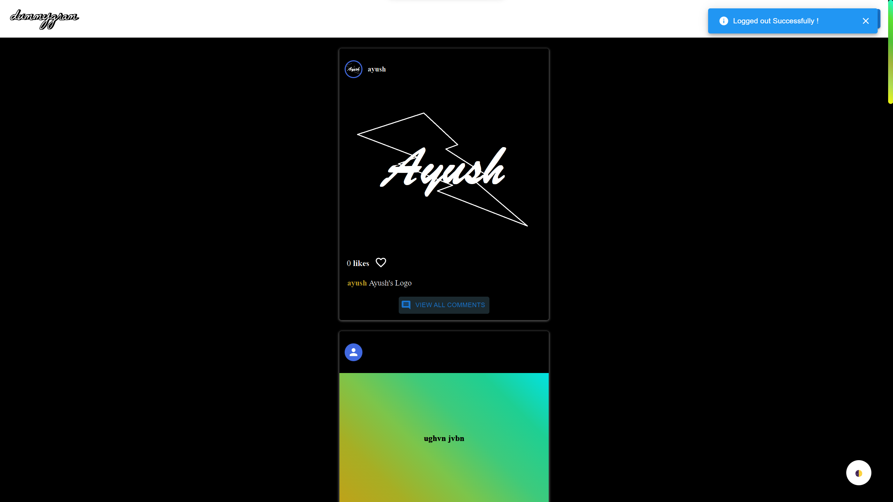

# Flow Of Control

## Opening Screen

You can SIGNIN or SIGNUP here and also view posts posted on dummygram.

 
 

## SIGNUP Dialog

 
 

## SIGNIN Dialog

 
 

## HOME Page

Now, you can create new post, like and comment on previous posts.

 
 

## New Post dialog

 
 

## New Post Preview dialog

 
 

## Post-posting

"Post was uploaded successfully!" will appear at right top.
You can view your post now.

 
 

## Adding Reactions in Comments

You can add reaction in comments by clicking on emoji tab.

 
 

## Comment Dialog

You can view all comments on post on this dialog.

 
 

## Theme Switching

You can switch between Light mode and Dark mode using bottom-right button.

 
 

## LOGOUT

You can logout using top-right "LOGOUT" button on nav bar.
"Logged out Successfully!" will appear at right top.
